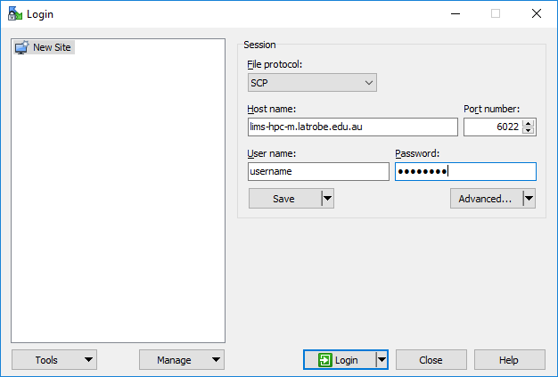
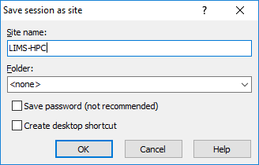
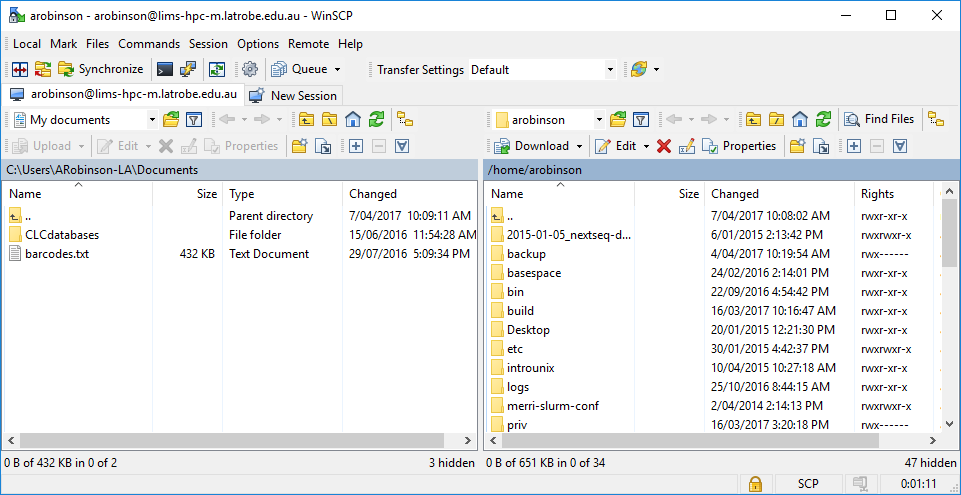

<style src="../includes/media/tute.css" ></style>
<style>em {font-style: normal; font-family: courier new;}</style>

# HPC Access

## Connecting

Click the link below to expand the relevant instructions for your Operating System

\showable{Mac OS X / Linux}{information}

Both Mac OS X and Linux come with a version of ssh (called OpenSSH) that can be used from the command line.  To use OpenSSH you must 
first start a terminal program on your computer.  On OS X the standard terminal is called Terminal, and it is installed by default. 
On Linux there are many popular terminal programs including: xterm, gnome-terminal, konsole (if you aren't sure, then xterm is a good 
default).  When you've started the terminal you should see a command prompt.  To log into LIMS-HPC, for example, type this command at 
the prompt and press return (where the word username is replaced with your LIMS-HPC username):


*$ ssh -p 6022 username@lims-hpc-m.latrobe.edu.au*


The same procedure works for any other machine where you have an account except that if your Unix computer uses a port other than 22 you will
need to specify the port by adding the option *-p PORT* with PORT substituted with the port number.

You may be presented with a message along the lines of:

```text
The authenticity of host 'lims-hpc-m.latrobe.edu.au (131.172.36.150)' can't be  established.
...
Are you sure you want to continue connecting (yes/no)?
```

Although you should never ignore a warning, this particular one is nothing to be concerned about; type **yes** and then **press enter**. 
If all goes well you will be asked to enter your password.  Assuming you type the correct username and password the system should 
then display a welcome message, and then present you with a Unix prompt.  If you get this far then you are ready to start entering 
Unix commands and thus begin using the remote computer.

\endshowable

\showable{Windows}{information}

On Microsoft Windows (Vista, 7, 8) we recommend that you use the PuTTY ssh client.  PuTTY (putty.exe) can be downloaded 
from this web page:

[http://www.chiark.greenend.org.uk/~sgtatham/putty/download.html](http://www.chiark.greenend.org.uk/~sgtatham/putty/download.html)

Documentation for using PuTTY is here:

[http://www.chiark.greenend.org.uk/~sgtatham/putty/docs.html](http://www.chiark.greenend.org.uk/~sgtatham/putty/docs.html)

When you start PuTTY you should see a window which looks something like this:


To connect to LIMS-HPC you should enter *lims-hpc-m.latrobe.edu.au* into the box entitled "Host Name (or IP address)" 
and *6022* in the port, 
then click on the Open button. All of the settings should remain the same as they were when PuTTY started (which should be the 
same as they are in the picture above).

In some circumstances you will be presented with a window entitled PuTTY Security Alert. It will say something along the lines 
of *"The server's host key is not cached in the registry"*. This is nothing to worry about, and you should agree to continue (by 
clicking on Yes). You usually see this message the first time you try to connect to a particular remote computer.

If all goes well, a terminal window will open, showing a prompt with the text *"login as:"*. An example terminal window is shown 
below. You should type your LIMS-HPC username and press enter. After entering your username you will be prompted for your 
password. Assuming you type the correct username and password the system should then display a welcome message, and then 
present you with a Unix prompt. If you get this far then you are ready to start entering Unix commands and thus begin using 
the remote computer.


\endshowable


## Transfer files

Click the link below to expand the relevant instructions for your Operating System

Note: if you are wanting to transfer files from/to another HPC system, use the Linux instructions and do it directly from either HPC 
(i.e. first login using SSH/Putty).

\showable{Mac OS X / Linux}{information}

Both Mac OS X and Linux come with software that enables you to transfer files to and from LIMS-HPC.  There are two commands you can
use: *scp* and *rsync*.  The differences are that the *scp* command is easier to use and *rsync* does some verification that transfer 
was successful.  We will use *scp* here however if you want to use *rsync* see the [Archiving](../hpc-archive/#transferring) page or
the *rsync* manpage.

The *scp* command works very much like the *cp* with the only difference being how you specify files on the remote server.

**Example filenames**

```sh
## specifying local file(s) ##
# full path
/home/group/mylab/mydir/myfile.txt
# relative file
myfile.txt
# relative path
mydir/myfile.txt
# wildcards
mydir/*.fa

## specifying a remote file ##
# full remote path
username@lims-hpc-m.latrobe.edu.au:/home/group/mylab/mydir/myfile.txt
# if your username is same on both computers you can leave it off
lims-hpc-m.latrobe.edu.au:/home/group/mylab/mydir/myfile.txt
# relative file (remote relative files are always relative to your home directory)
lims-hpc-m.latrobe.edu.au:myfile.txt
lims-hpc-m.latrobe.edu.au:../group/mylab/mydir/myfile.txt
```
**Example *scp* commands**

The SOURCE\_FILE(s) are the files that currently exist and DESTINATION\_FILE\_OR\_DIR is where you want them to be copied.  Either the 
SOURCE or DESTINATION files can be a remote (but not both).  As with *cp*, if you specify multiple source files (or wildcard) the 
destination must be an existing directory.

```sh
# structure
scp -P 6022 SOURCE_FILES DESTINATION_FILE_OR_DIR

# example (1 file) PC to LIMS-HPC
scp -P 6022 myfile.txt username@lims-hpc-m.latrobe.edu.au:/home/group/mylab/mydir/

# example (1 file) LIMS-HPC to PC
scp -P 6022 username@lims-hpc-m.latrobe.edu.au:/home/group/mylab/mydir/myfile.txt .

# example (whole directory) PC to LIMS-HPC
scp -P 6022 -r myfiles/ username@lims-hpc-m.latrobe.edu.au:/home/group/mylab/mydir/

# example (wildcards) PC to LIMS-HPC
# wildcards only work on source
scp -P 6022 myfiles/*.fa username@lims-hpc-m.latrobe.edu.au:/home/group/mylab/mydir/
```

Note: the port option (*-P 6022*) is only needed when the remote server is LIMS-HPC.  If you are transferring files to/from another HPC (from LIMS-HPC)
you don't need port 6022.  The default port is 22 which most HPCs use.


\endshowable

\showable{Windows}{information}

As with connecting to LIMS-HPC, Windows requires a third party software package in order to transfer files.  We recommend that you
use **WinSCP**


**Download Software**

Open the [WinSCP Download page](https://winscp.net/eng/download.php) in your browser.

If you have administrator access on your computer, it is best to download the **Installation Package**.  However, if you are not
then get the **Portable executables** instead.


**Connecting with WinSCP**

When you first start WinSCP it will present you with a screen like below.



* Complete form fields
    * **File protocol**: SCP
    * **Host name**: lims-hpc-m.latrobe.edu.au
    * **Port number**: 6022
    * **User name**: Your LIMS-HPC username
    * **Password**: Your LIMS-HPC password
* Click **Save** button (so you don't need to type it in future)



* Give the session a **Site name** of **LIMS-HPC**
* Click **OK** button
* Double-click on **LIMS-HPC** from the left-hand list.  In future, you can skip all above steps.


**Transferring files**

Once connected you will be presented with a window resembling below however the files will depend on the files in your computer or 
LIMS-HPC accounts.



The **left-hand list** of files are those on **your PC** and the **right-hand list** are **LIMS-HPC**.  You can browse the directories 
on each side like you would using the file explorer on your PC.

To transfer files from LIMS-HPC to your PC simply drag them from the right-hand list to the left-hand list.

To transfer files from your PC to LIMS-HPC drag them left to right.

Note: the first time you transfer a file (or directory) you will be asked how to do it; simply accept the window (and tick the box to 
not show in future if you want)

\endshowable

